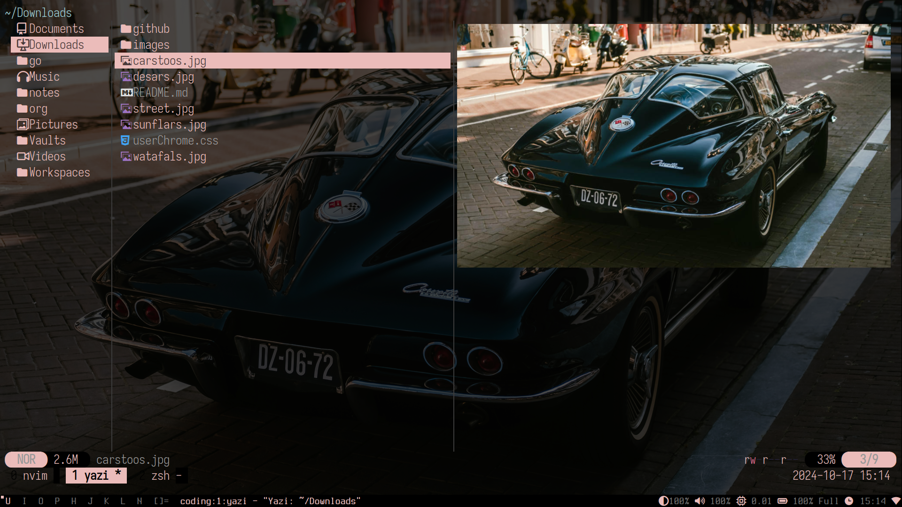
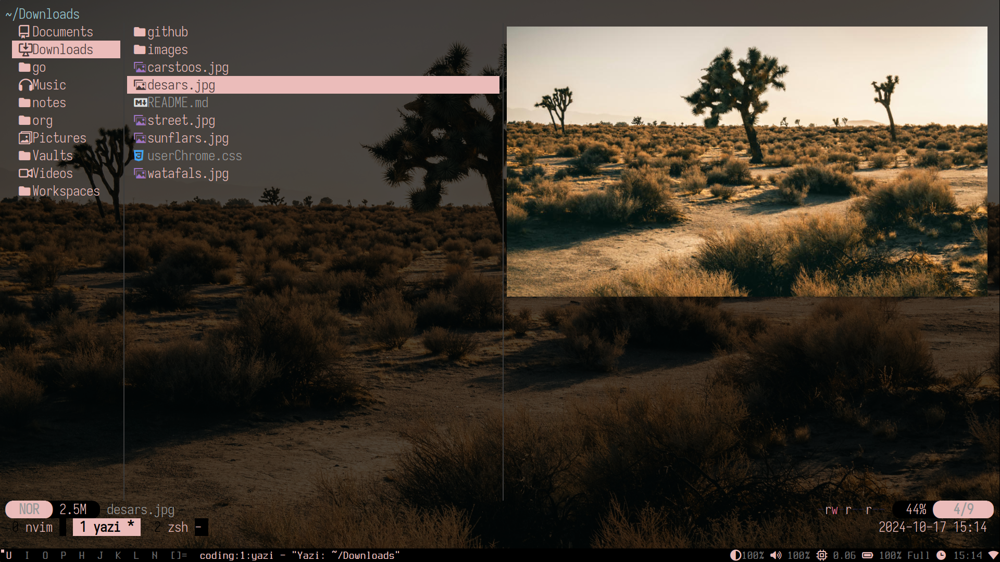
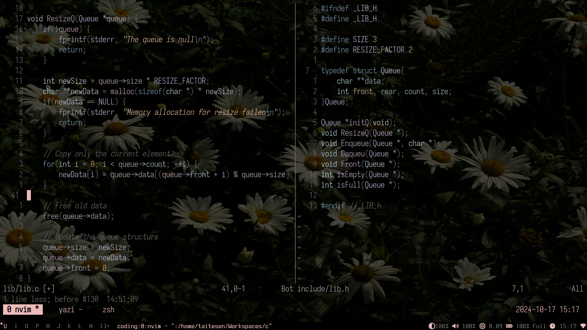
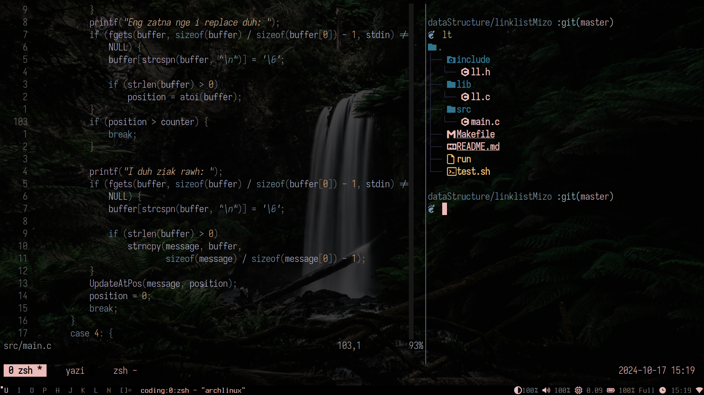

# Dotfiles Setup Guide
This repository contains my personal dotfiles and configurations for a minimal Arch Linux setup using DWM (Dynamic Window Manager), Neovim, Picom, and more. The setup also includes custom configurations for terminal utilities, fonts, and various applications.

## Prerequisites
Before proceeding, ensure that you have the following software installed:

- **curl**: To download necessary files
- **git**: To clone repositories
- **bash**: To execute the installation script

```bash
sudo pacman -S --noconfirm --needed git curl
```
## Installation Steps
### 1. Clone the Repository
Clone this repository into your home directory:
```bash
git clone https://github.com/taitesen/dwm.git ~/dotfiles
cd ~/dotfiles
```
### 2. Run the Installation Script
The provided install.sh script will automate the installation of required packages, dependencies, and configurations.

Make the script executable and run it:
```bash
sudo chmod +x install.sh
./install.sh
```
### 3. What the Script Does
The script performs the following steps:

#### 3.1 Creates Required Directories
The script will create essential directories if they don’t already exist:
```bash
mkdir -p ~/Documents ~/Downloads ~/Pictures ~/Videos ~/Music ~/Workspaces ~/Vaults/git
```
It will also move the dotfiles directory into the ~/Vaults/git directory for organization.

#### 3.2 Installs System Packages
The script installs system packages using pacman and yay. It updates the system and installs:

Fonts from `packages/fonts.txt` <br>
Core utilities from `packages/core.txt` <br>
Other utility tools from `packages/utility.txt` <br>
Additionally, it installs `yay`, the AUR helper, and uses it to install packages like `picom-git`, `vesktop-bin`, and `ueberzugpp`.

#### 3.3 Changes Default Shell to Zsh
The script sets Zsh as the default shell for the user:
```bash
chsh -s "$(which zsh)"
```
If Zsh is not installed, the script will exit with an error.

#### 3.4 Installs Neovim Configuration
The script clones the Neovim configuration from my GitHub repository and sets it up in your home directory.
```bash
git clone https://github.com/taitesen/nvim.git ~/Vaults/git/nvim
```
#### 3.5 Copies Configuration Files
The script copies various configuration files to your home directory and ~/.config/:

`.xinitrc`, `.zprofile`, `.Xresources`, `.tmux.conf` → `~/`
Configurations for applications like `fastfetch`, `picom`, `qutebrowser`, and `starship.toml` → `~/.config/`
#### 3.6 Installs DWM Environment
The script will compile and install several programs, including:

**DWM** (Dynamic Window Manager) <br>
**Dmenu** (Launcher) <br>
**Dwmblocks** (Status Bar) <br>
**ST** (Simple Terminal) <br>
It uses the `make` utility to build and install these programs.

#### 3.7 Post-Installation: Reboot
At the end of the installation, the script will prompt you to reboot the system to apply changes.
```bash
echo -e "Reboot now? [y/n]: \c"
read RESTART_CHOICE
```
If you choose "yes", the system will automatically reboot.

### 4. Keybindings
Here are some important keybindings you can use once the installation is complete:

Mod Key (Win) is the default modifier key. <br>
**Window Management** <br>
<kbd>Mod + Enter</kbd>: Spawn terminal <br>
<kbd>Mod + Space</kbd>: Spawn dmenu <br>
<kbd>Mod + c</kbd>: Kill client <br>
<kbd>Mod + ,</kbd>: Previous window <br>
<kbd>Mod + .</kbd>: Next window <br>
**Tag Navigation** <br>
<kbd>Mod + u</kbd>: Jump to 1st window tag <br>
<kbd>Mod + i</kbd>: Jump to 2nd window tag <br>
<kbd>Mod + o</kbd>: Jump to 3rd window tag <br>
<kbd>Mod + p</kbd>: Jump to 4th window tag <br>
<kbd>Mod + h</kbd>: Jump to 5th window tag <br>
<kbd>Mod + j</kbd>: Jump to 6th window tag <br>
<kbd>Mod + k</kbd>: Jump to 7th window tag <br>
<kbd>Mod + l</kbd>: Jump to 8th window tag <br>
<kbd>Mod + n</kbd>: Jump to 9th window tag <br>
**Miscellaneous** <br>
<kbd>Mod + Shift + b</kbd>: Toggle blur <br>
<kbd>Mod + b</kbd>: Toggle bar <br>

#### 5. Screenshots
Here are some screenshots of the setup:
##### Old Screenshot


---
##### Updated Screenshot
- Workspaces

- Yazi

- Another yazi

---
##### Latest Screenshot
- Random

- Random

- Random

- Random

---
#### 6. Troubleshooting
If you encounter issues during installation, here are a few things to check:

**Missing Dependencies**: Ensure that your system is up-to-date and that you have all the required tools installed (e.g., `git`, `yay`, `make`, etc.). <br>
**Zsh Not Installed**: If the script reports that Zsh is not installed, install it manually:
```bash
sudo pacman -S zsh
```
**Reboot Not Happening**: If the reboot prompt doesn't work, manually reboot your system:
```bash
sudo reboot
```
#### 7. Customization
Feel free to modify the configuration files and customize the setup as per your needs. You can edit the dotfiles in the `~/Vaults/git/dotfiles` directory or change the keybindings in the DWM configuration.

### License
This project is licensed under the MIT License. See the LICENSE file for more details.

### Conclusion
By following the above steps, you should have a fully functional Arch Linux environment with DWM, Neovim, Picom, and other utilities configured and ready to use. If you have any questions or encounter issues, feel free to open an issue in the repository.
