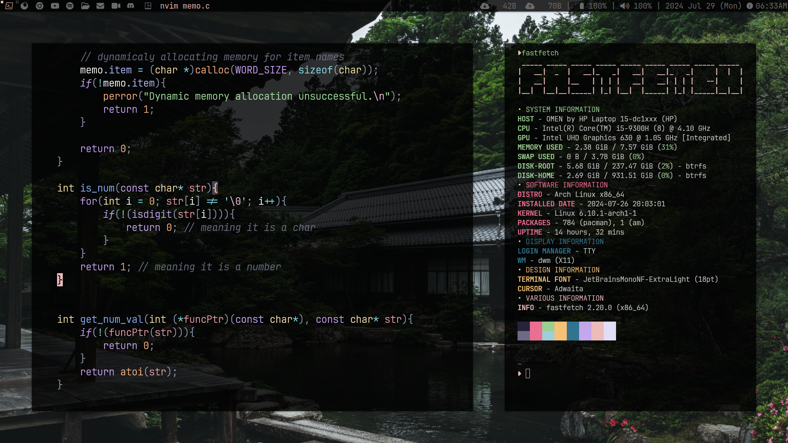
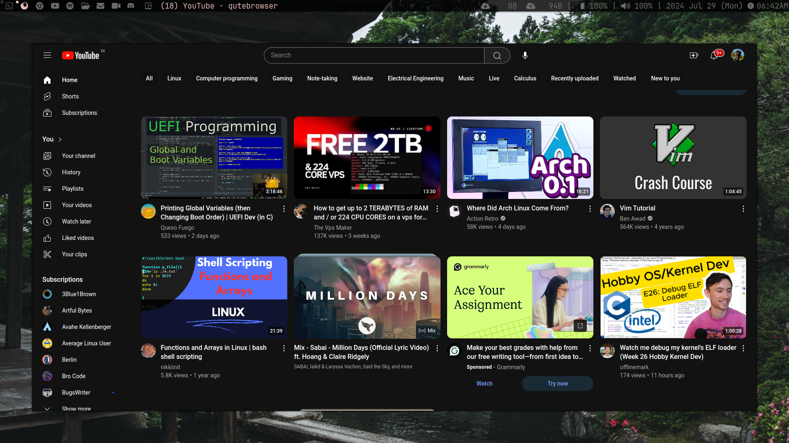
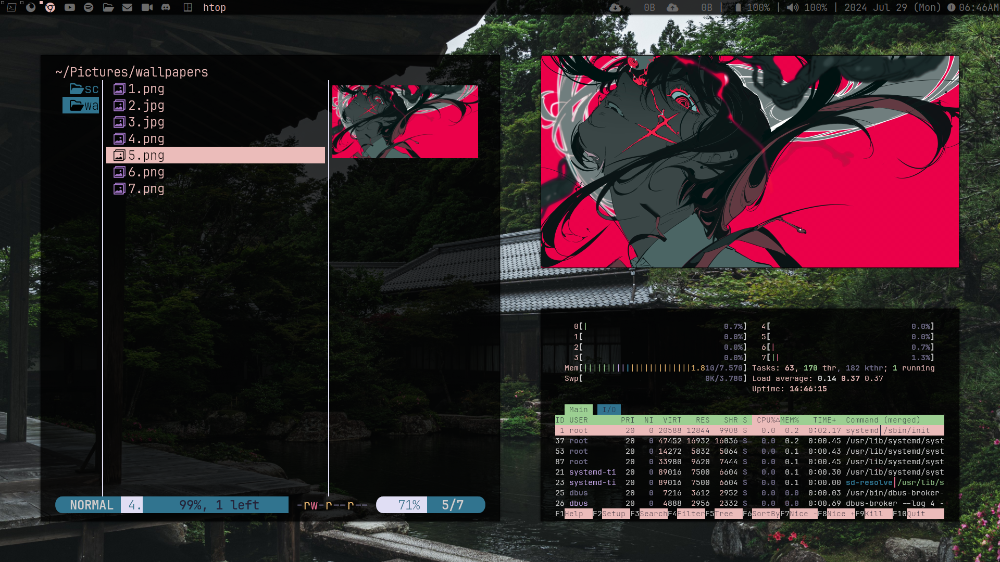
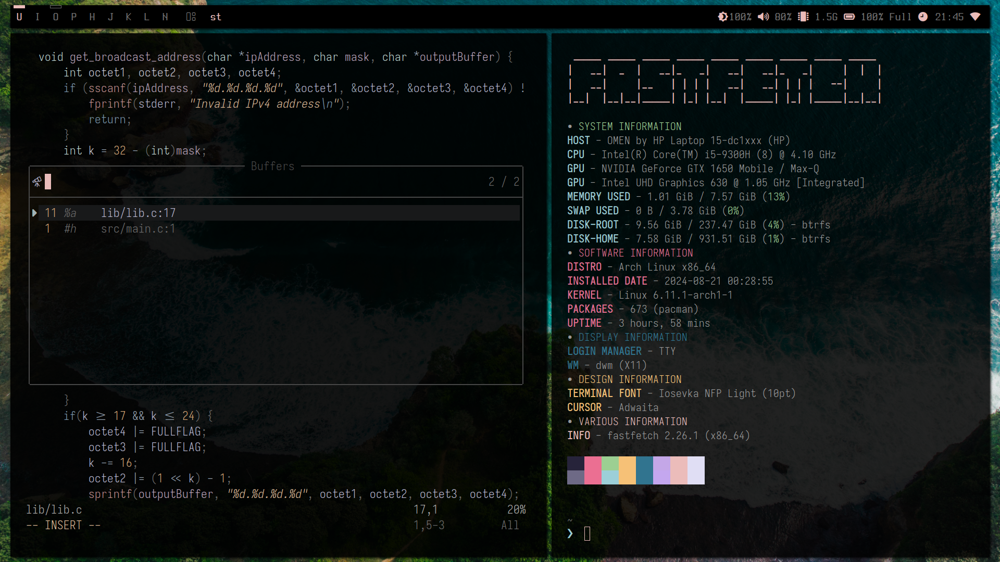
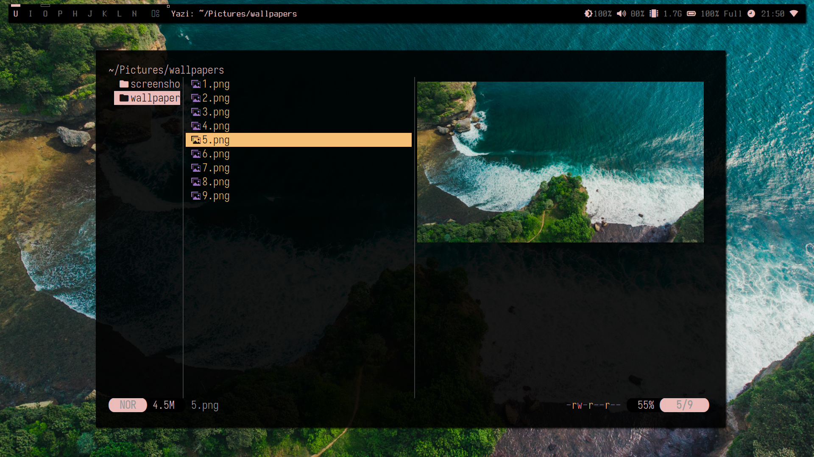
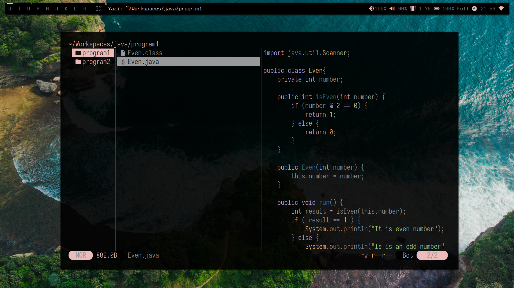

# NOTE
> [!TIP]
> Cloning the repo and running the `install.sh` is not recommended. Run the command below instead.

- Pre-requisite: `curl`
```sh
sh -c "$(curl -fsSL https://raw.githubusercontent.com/taitesen/dwm/master/install.sh)"
```
---
### Old Screenshot






### Updated Screenshot
- Workspaces

- Yazi

- Another yazi

---
## Important Keybinds
- Default <kbd>Mod Key</kbd> is <kbd>Win</kbd>
- <kbd>Mod Key + Enter </kbd> spawn Terminal
- <kbd>Mod Key + space </kbd> spawn dmenu
- <kbd>Mod Key + c </kbd> kill client
- <kbd>Mod Key + , </kbd> prev window
- <kbd>Mod Key + . </kbd> next window
- <kbd>Mod Key + Ctrl + , </kbd> Cycle next window layout
- <kbd>Mod Key + Ctrl + . </kbd> Cycle prev window layout
- <kbd>Mod Key + u </kbd> Jumps to 1st window tag
- <kbd>Mod Key + i </kbd> Jumps to 2st window tag
- <kbd>Mod Key + o </kbd> Jumps to 3st window tag
- <kbd>Mod Key + p </kbd> Jumps to 4st window tag
- <kbd>Mod Key + h </kbd> Jumps to 5st window tag
- <kbd>Mod Key + j </kbd> Jumps to 6st window tag
- <kbd>Mod Key + k </kbd> Jumps to 7st window tag
- <kbd>Mod Key + l </kbd> Jumps to 8st window tag
- <kbd>Mod Key + n </kbd> Jumps to 9st window tag
- <kbd>Mod Key + shift + b </kbd> Toggle blur
- <kbd>Mod Key + b </kbd> Toggle bar
